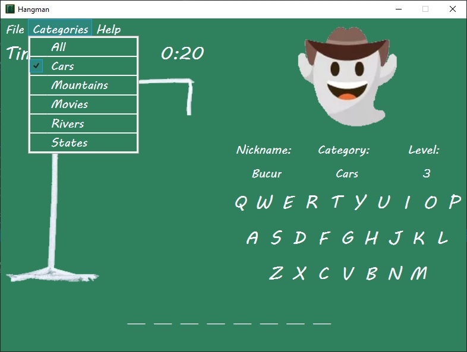

# Hangman
**My version of Hangman made in C# using WPF.**

- This project is an implementation of Hangman in C# using WPF in Visual Studio.
- I created this application as part of the Visual Programming Enviroments' laboratories at the university.
- This app is structured on the Model-View-ViewModel architecture.
- The user data, like name, profile picture - selected from a list of images - state of the game, word to be guessed, number of mistakes, level, is stored persistently using XML serilization.
- This data is found in User.xml. Words grouped by category are stored in Words.xml.

|  |  |
|:---:|:---:|
|  |  |

From Home Screen the user can choose either to Sign In or to Sign Up. The Login process is trivial - the user choose a nickname from the list (the image updates automatically) and then presses Play. The user can also Add another account, Edit, or Delete an existing one. When adding a new account, the user has to choose a nickname and also a profile picture.

After registration/authentication the user will choose a category of words. 

|  |  |
|:---:|:---:|

In Game window some information about the user are displayed - like nickname, profile picture - and some information about the game - like category, level.

In File menu you will find some actions like New Game, Save Game, Exit Game and Statistics. Categories menu let you change the category of words you play. Help menu leads to About window.

|  |  |
|:---:|:---:|
|  |  |

When in game you can choose any letter to find if appears in the word or not. If the letter appears, the button will be locked and marked with green, and also will appear in the word below. If the letter doesn't appear, the button will be locked and marked with red, and also the Hangman will be updated.

|  |  |
|:---:|:---:|
|  |  |

If the time is up, a warning will be shown and the game will be lost. If 6 mistakes are made the game will also be lost. When you guess a word the level will increase and at 5 levels won in a row you will win a game.

In Statistics window you will find information about how many games you won and lost at any category and in total, and how many games you played in total.

